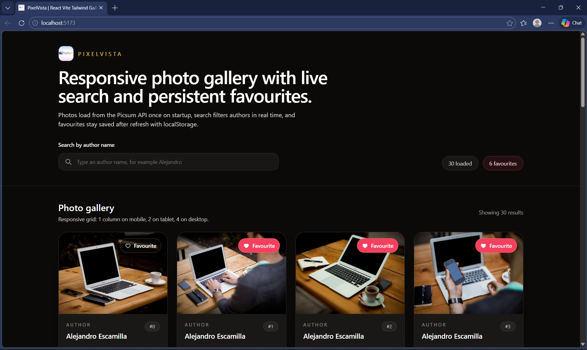

# Pixel Vista

Modern and responsive photo gallery project built with React, Vite, and Tailwind CSS.

## Preview




## Highlights

- Fast React + Vite setup for smooth development experience
- Responsive gallery layout for mobile, tablet, and desktop
- Author-based search for quick filtering
- Favorites management using reducer-based state flow
- Local storage persistence for saved favorites
- Large image preview modal for better browsing

## Tech Stack

- React
- Vite
- Tailwind CSS
- JavaScript (ES6+)

## Project Structure

```text
photo-gallery-app/
  assets/
    screenshots/
      gallery-preview.png
      home-preview.png
  public/
    pixelvista-logo.png
  src/
    components/
      Footer.jsx
      Gallery.jsx
      PhotoCard.jsx
      PreviewModal.jsx
      SearchBar.jsx
    hooks/
      useFetchPhotos.js
    reducer/
      favouritesReducer.js
    App.jsx
    index.css
    main.jsx
  index.html
  package.json
  tailwind.config.js
  vite.config.js
```

## Getting Started

```bash
npm install
npm run dev
```

## Production Build

```bash
npm run build
npm run preview
```

## Author

Sekhar
